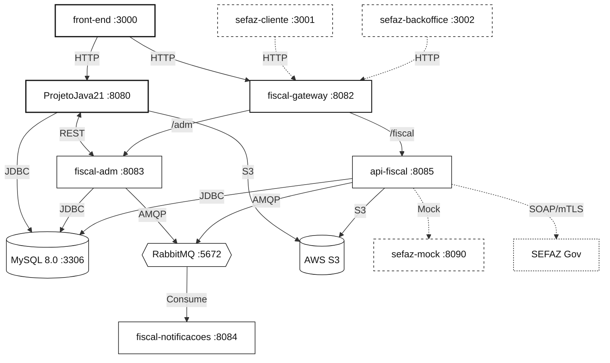

# 🌐 RouterLink - Infraestrutura & Orquestração Local (Docker)

Repositório central de orquestração local em Docker para todo o ecossistema **RouterLink (ERP, Gateway, Fiscal, Notificações e Módulos SEFAZ)**. 

Este ambiente espelha 100% o comportamento, contratos de rede e topologia de produção, permitindo desenvolvimento com paridade total sem a sobrecarga e os custos operacionais de um cluster Kubernetes.

---

## 🏛️ Topologia da Arquitetura



---

## 🚀 Comandos de Inicialização

### 1. Preparação Inicial do Ambiente
Antes de rodar pela primeira vez, copie as variáveis de ambiente:
```bash
cp .env.example .env
```

### 2. Inicialização Padrão (Sem os Módulos SEFAZ)
Sobe toda a base de dados, mensageria, microserviços centrais e o frontend principal:
```bash
docker compose up -d
```
> **Nota:** Os módulos fiscais avançados do SEFAZ permanecem desligados para economizar memória e CPU da máquina dos desenvolvedores.

### 3. Inicialização Completa com Perfil SEFAZ Ativado
Para desenvolvedores que forem atuar diretamente nas rotinas fiscais e emissores:
```bash
docker compose --profile sefaz up -d
```
*(Inicia adicionalmente: `sefaz-cliente`, `sefaz-backoffice` e `sefaz-mock-service`)*

---

### 4. Modo Ágil para Desenvolvedores (Somente Infraestrutura)
Se você estiver codando na sua IDE (IntelliJ/VS Code) e no terminal com `npm run dev`, você não precisa rodar os containers das suas próprias aplicações no Docker. Suba apenas a camada de bancos e brokers:
```bash
docker compose up -d mysql rabbitmq
```

---

## 🛠️ Comandos de Gestão e Diagnóstico

| Ação | Comando |
| :--- | :--- |
| **Ver status e healthchecks** | `docker compose ps` |
| **Acompanhar logs de todos os serviços** | `docker compose logs -f` |
| **Logs de um serviço específico** | `docker compose logs -f fiscal-adm` |
| **Reconstruir imagens após alteração** | `docker compose up -d --build` |
| **Parar todos os containers** | `docker compose down` |
| **Parar e limpar volumes (Reset Total do Banco)** | `docker compose down -v` |

---

## 🔌 Painéis e Portas Mapeadas

* **Frontend ERP:** [http://localhost:3000](http://localhost:3000)
* **Backend ERP (ProjetoJava21):** [http://localhost:8080/swagger-ui.html](http://localhost:8080/swagger-ui.html)
* **Service Registry (Eureka):** [http://localhost:8081](http://localhost:8081)
* **Fiscal Gateway (APIs & Swagger Central):** [http://localhost:8082/swagger-ui.html](http://localhost:8082/swagger-ui.html)
* **RabbitMQ Management Dashboard:** [http://localhost:15672](http://localhost:15672)  
  * *Usuário:* `router_admin` | *Senha:* `router_pass`
* **MySQL 8.0:** `localhost:3306` (bancos: `erp_db`, `adm_db` e `fiscal_db`)
* **SEFAZ Cliente (Profile sefaz):** [http://localhost:3001](http://localhost:3001)
* **SEFAZ Backoffice (Profile sefaz):** [http://localhost:3002](http://localhost:3002)
* **SEFAZ Wiremock Service (Profile sefaz):** [http://localhost:8090](http://localhost:8090)

---

## 📬 Mensageria: Filas e Exchanges Pré-configuradas (RabbitMQ)

Ao subir o container do RabbitMQ, os seguintes recursos são carregados automaticamente via `rabbitmq/definitions.json`:
* **VHost:** `/`
* **Exchanges:**
  * `adm.events.exchange` (direct)
  * `fiscal.events.exchange` (direct)
* **Filas (Queues):**
  * `adm.email.default` (durável) — E-mails disparados pelo administrativo (boas-vindas, recuperação de senha, contratos).
  * `fiscal.email.default` (durável) — E-mails disparados pelo motor fiscal (DANFE, XML da NF-e).
  * `fiscal.nfe.processamento` (durável) — Fila de transmissão/processamento assíncrono fiscal.

---

## 🔐 Seção Completa de Variáveis de Ambiente (`.env`)

Abaixo estão os blocos de configuração para cada repositório do ecossistema:

### 1. Bloco de Variáveis: Infraestrutura (`routerlink-infra/.env`)
```properties
# ==============================================================================
# INFRAESTRUTURA GERAL
# ==============================================================================
COMPOSE_PROJECT_NAME=routerlink

# ==============================================================================
# BANCO DE DADOS: MySQL 8.0
# ==============================================================================
MYSQL_PORT=3306
MYSQL_ROOT_PASSWORD=root_secure_password
MYSQL_DATABASE=adm_db
MYSQL_USER=router_user
MYSQL_PASSWORD=router_pass


# ==============================================================================
# MENSAGERIA: RabbitMQ 3
# ==============================================================================
RABBITMQ_PORT=5672
RABBITMQ_MGMT_PORT=15672
RABBITMQ_DEFAULT_USER=router_admin
RABBITMQ_DEFAULT_PASS=router_pass

# ==============================================================================
# PORTAS DOS SERVIÇOS
# ==============================================================================
ERP_PORT=8080
GATEWAY_PORT=8082
ADM_PORT=8083
FISCAL_PORT=8085
NOTIFICACOES_PORT=8084
FRONTEND_PORT=3000
SEFAZ_CLIENTE_PORT=3001
SEFAZ_BACKOFFICE_PORT=3002
SEFAZ_MOCK_PORT=8090

# ==============================================================================
# SEGREDOS COMPARTILHADOS
# ==============================================================================
JWT_SECRET=dev-secret-jwt-key-987654321012345678901234567890
JASYPT_MASTER_PASSWORD=masterpass_development_secret
```

---

### 2. Bloco de Variáveis: Frontend ERP (`front-end/.env`)
Copie e cole diretamente no arquivo `.env` dentro do repositório `front-end`:

```properties
VITE_API_HOST = "routerlink-jpkmvcvtcn.dynamic-m.com:50011"
VITE_API_PORT = "8090"
VITE_API_BASE_URL = "http://routerlink-jpkmvcvtcn.dynamic-m.com:50011"

VITE_MUI_X_LICENSE_KEY = "bb84b24fd63ca288b7ddb17565c0c8b5Tz0xMjMwNDAsRT0xNzk3MDMzNTk5MDAwLFM9cHJvLExNPXN1YnNjcmlwdGlvbixQVj1RMy0yMDI0LEtWPTI="

# 💡 Alternativa para rodar 100% Local (Docker):
# VITE_API_HOST = "localhost:8080"
# VITE_API_PORT = "8080"
# VITE_API_BASE_URL = "http://localhost:8080"
```

---

### 3. Bloco de Variáveis: Microserviço `fiscal-gateway` (`application.properties`)
```properties
SERVER_PORT=8082
JWTKEY=dev-secret-jwt-key-987654321012345678901234567890

# Rotas Internas para os serviços
ADM_SERVICE_URL=http://fiscal-adm:8083
FISCAL_SERVICE_URL=http://api-fiscal:8085
```

---

### 4. Bloco de Variáveis: Backend Core ERP (`ProjetoJava21` / `application.properties`)
```properties
ERP_APP_PORT=8080

# Banco de Dados
ERP_DB_HOST=mysql:3306
ERP_DB_DATABASE=erp_db
ERP_DB_USUARIO=router_user
ERP_DB_SENHA=router_pass

# Segurança e Criptografia
JWT_SECRET=routerlink@2023
key=715f30d0c56331e0

# Integração com Módulo Fiscal
FISCAL_ADM_URL=http://fiscal-adm:8083/adm

# Servidor SMTP (E-mails ERP)
EMAIL_HOST=smtp.mailtrap.io
EMAIL_PORTA=2525
EMAIL_USUARIO=mailtrap_user
EMAIL_SENHA=mailtrap_password

# Armazenamento AWS S3
accessKey=local_access_key
secret=local_secret_key
region=us-east-1
```

---

### 5. Bloco de Variáveis: Microserviço `fiscal-adm` (`.env` ou `application.properties`)
```properties
SERVER_PORT=8083
SERVER_SERVLET_CONTEXT_PATH=/adm

# Banco de Dados
ADM_DB_HOST=mysql:3306
ADM_DB_DATABASE=adm_db
ADM_DB_USUARIO=router_user
ADM_DB_SENHA=router_pass

# RabbitMQ
RABBIT_HOST=rabbitmq
RABBIT_PORT=5672
RABBIT_USER=router_admin
RABBIT_PASSWORD=router_pass
broker.queue.email.adm=adm.email.default

# Autenticação e Criptografia
JWT_SECRET=dev-secret-jwt-key-987654321012345678901234567890
JASYPT_MASTER_PASSWORD=masterpass_development_secret

# Armazenamento AWS S3 / Local
accessKey=local_access_key
secret=local_secret_key
region=us-east-1
bucketEmpresas=routerlink-empresas-dev
bucketContratos=routerlink-contratos-dev
bucketDocumentosFiscais=routerlink-documentos-fiscais-dev
```

---

### 6. Bloco de Variáveis: Microserviço `api-fiscal` (`.env` ou `application.properties`)
```properties
SERVER_PORT=8085

# Banco de Dados
FISCAL_DB_HOST=mysql:3306
FISCAL_DB_DATABASE=fiscal_db
FISCAL_DB_USUARIO=router_user
FISCAL_DB_SENHA=router_pass

# RabbitMQ
RABBIT_HOST=rabbitmq
RABBIT_PORT=5672
RABBIT_USER=router_admin
RABBIT_PASSWORD=router_pass
broker.queue.email.fiscal=fiscal.email.default

# Criptografia e Armazenamento
JASYPT_MASTER_PASSWORD=masterpass_development_secret
accessKey=local_access_key
secret=local_secret_key
region=us-east-1
bucketEmpresas=routerlink-empresas-dev
bucketDocumentosFiscais=routerlink-documentos-fiscais-dev
```

---

### 7. Bloco de Variáveis: Microserviço `fiscal-notificacoes` (`.env` ou `application.properties`)
```properties
SERVER_PORT=8084

# RabbitMQ
RABBIT_HOST=rabbitmq
RABBIT_PORT=5672
RABBIT_USER=router_admin
RABBIT_PASSWORD=router_pass
broker.queue.email.adm=adm.email.default
broker.queue.email.fiscal=fiscal.email.default

# Servidor SMTP (E-mails)
EMAIL_HOST=smtp.mailtrap.io
EMAIL_PORTA=2525
EMAIL_USUARIO=mailtrap_user
EMAIL_SENHA=mailtrap_password
```

---

### 8. Bloco de Variáveis: Módulos SEFAZ Web (`sefaz-cliente` e `sefaz-backoffice`)
```properties
VITE_API_URL=http://localhost:8082/fiscal
VITE_API_SECRET_KEY=dev-secret-jwt-key-987654321012345678901234567890
```

---

## 🎯 Padrões de Pull Request (Templates)

Para garantir a integridade entre o código e a infraestrutura:
* O template para este repositório de infraestrutura está em [`.github/pull_request_template.md`](.github/pull_request_template.md).
* O template para novos PRs nos microserviços está em [`pr-templates/PR_TEMPLATE_MICROSERVICES.md`](pr-templates/PR_TEMPLATE_MICROSERVICES.md).
* O template para PRs no frontend está em [`pr-templates/PR_TEMPLATE_FRONTEND.md`](pr-templates/PR_TEMPLATE_FRONTEND.md).
